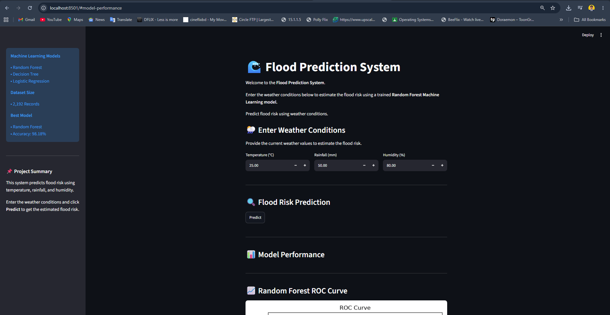

# 🌊 Flood Prediction System

A Machine Learning-based Flood Prediction System developed using Python and Streamlit to estimate flood risk based on weather conditions.

## 📌 Features

- Flood Risk Prediction (High / Low)
- Flood Probability
- Prediction History
- Clear History
- Safety Recommendations
- Model Performance Dashboard
- ROC Curve
- Confusion Matrix
- Feature Importance
- Interactive Streamlit Web Application

---

## 🤖 Machine Learning Models

- Random Forest
- Decision Tree
- Logistic Regression

---

## 📊 Dataset

- Total Records: 2,192
- Features:
  - Temperature
  - Rainfall
  - Humidity
- Target:
  - Flood Risk

---

## 🛠 Technologies Used

- Python
- Streamlit
- Pandas
- Scikit-learn
- Matplotlib
- Seaborn
- Joblib

---

## 🚀 How to Run

### 1. Clone the Repository

```bash
git clone https://github.com/MdNur23/Flood-Prediction-BD.git
```

### 2. Open the Project

```bash
cd Flood-Prediction-BD
```

### 3. Install Dependencies

```bash
pip install -r requirements.txt
```

### 4. Run the Application

```bash
streamlit run app.py
```

---

## 📈 Model Performance

| Model | Accuracy |
|-------|---------:|
| Random Forest | 98.18% |
| Logistic Regression | 97.95% |
| Decision Tree | 96.58% |

---

## 📷 Application Screenshot



## 📄 License

This project is developed for educational and research purposes.